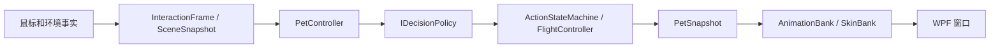

# 项目结构与扩展边界

项目包含两个正式程序集。Core 为纯 .NET 逻辑；DesktopCock 为 Windows/WPF 宿主。命名空间保持兼容，目录按职责组织。

| 目录 | 职责 |
| --- | --- |
| `src/DesktopCock.Core/Model` | PetProfile、固定性格、烦躁与注意力状态、参数解析 |
| `src/DesktopCock.Core/Behavior` | 默认决策策略、动作执行器、注视与连续转身进度 |
| `src/DesktopCock.Core/Interaction` | 语义交互、互动模式及手型会话生命周期 |
| `src/DesktopCock.Core/Movement` | 飞行运动、平台稳定性与坐标模型 |
| `src/DesktopCock.Core/Runtime` | PetController 协调地面与飞行，输出只读 PetSnapshot |
| `src/DesktopCock/Presentation` | 透明窗口、托盘、动画与羽色映射；窗口不选择飞行目标 |
| `src/DesktopCock/Input` | 原生鼠标消息、命中检测、鼠标运动转语义交互 |
| `src/DesktopCock/Perception` | GPU 捕获、检测、追踪、后台快照发布 |
| `src/DesktopCock/Platform` | Windows 平台接口 |
| `src/DesktopCock/Configuration` | 应用设置、旧平铺 JSON 兼容适配 |
| `src/DesktopCock/Diagnostics` | 仅 Debug 编译的预览、覆盖层和性能采样 |

## 接口与单位

- 宿主注入时间、系统空闲时长、平台快照和必要的实时支撑验证。Core 不调用系统时钟、Windows、GPU 或资源文件。
- `Behavior` 维护地面时间及交互记忆，先处理睡眠唤醒和不可打断阶段，再调用 `IDecisionPolicy.Choose`。`ActionStateMachine` 管理执行、持续窗口与啄咬/唱歌冷却，替换策略也不能绕过这些限制。默认策略保留现有规则顺序与随机抽样顺序。
- `IRandomSource` 可注入；`SeededRandom` 支持固定种子。地面决策与飞行选择各有独立随机源。
- `PetController` 拥有地面与飞行协调。飞行期间地面时间不推进；平台丢失、过期、被遮挡或飞行超时会重新找落点，最终回到任务栏。宿主隐藏或锁屏时停止感知，恢复可见后回到任务栏。
- 位置、平台范围和飞行速度使用物理屏幕像素；地面移动距离、鼠标速度和关注位置使用角色逻辑像素。协调层在移动边界应用 Scale；命中检测由宿主按当前帧锚点转换。
- `GroundSnapshot` / `PetSnapshot` 为值快照，没有位图、路径或帧编号。当前 `Mood` 名称为兼容保留，语义是动作状态。
- 转身持续 0.44 秒，0.22 秒换向；Core 输出 0–1 进度。AnimationBank 按 Turn 片段的时长比例选帧，不要求四帧。资源应在进度中点保持正面衔接。
- Walk 按累计实际移动距离与 `stridePixels` 映射帧。其余动作按经过时间选帧。行为时长由状态机控制，不依赖动画完成回调；发声期间 Sing 的剩余时长由宿主反馈音频播放进度，结束或取消时收回动作。

## 音频与学习

Core/Audio 定义发声请求、播放快照、口型时间轴和短语记忆；Windows 宿主 Audio 负责 WASAPI 输出、仅主动开启的麦克风、后台 whisper.cpp + Silero VAD、素材与本地缓存。声音与口型共享设备播放位置；嘴部局部渲染与身体动作、羽色独立。完整能力及未完成的音色模型边界见 [音频说明](AUDIO.md)。

## 后续性格、注意力与手型

`PetProfile` 保存稳定标识和固定 `PetPersonality`；好奇、亲人、耐心范围 0–1，默认 0.5。`PetState` 独立保存当前烦躁及 `AttentionState`。关注来源包括鼠标、手、环境目标；离开或目标无效时清除。默认只映射既有鼠标附近信号，没有新增吸引力、衰减或消耗规则。

`IBehaviorParameterResolver` 是性格影响参数的边界。当前 NeutralParameterResolver 验证配置后原样使用基础参数，不调整概率。后续实现新的解析器或决策策略即可，动画层无需修改。尚无成长算法或新存档格式。

`InteractionSession` 管理模式、手型 ID、手势开始/结束和取消事件；Core 只接受语义输入。Alt+1 进入接鸟手型，Alt+2 进入摸头手型，Alt+反引号退出。切换手型先取消旧手势；退出、隐藏、锁屏、暂停都会取消并释放原生捕获。鸟上手后通过原生鼠标消息和绘制前采样跟随手型，离手时飞往有效落点。手部外观由宿主加载独立素材，Core 不依赖窗口或图片。

## 配置与资源

应用配置与 BehaviorParameters 在内存中分开；SettingsCodec 继续读取/写入原有平铺 JSON，缺少字段使用默认值。Release 与 Debug 数据目录分别为 `%LOCALAPPDATA%/DesktopCock` 和 `%LOCALAPPDATA%/DesktopCock.Debug`。两种构建共用原有单实例互斥量。

动画定义在 `art/actions/asset-bindings.json` 的 clips 中；来源、依赖和全部引用位置见自动生成的 [动画引用清单](../art/actions/ANIMATION_REFERENCES.md)。资源生成不会改变行为规则；构建仅验证资源，不生成或自动批准审核哈希。
